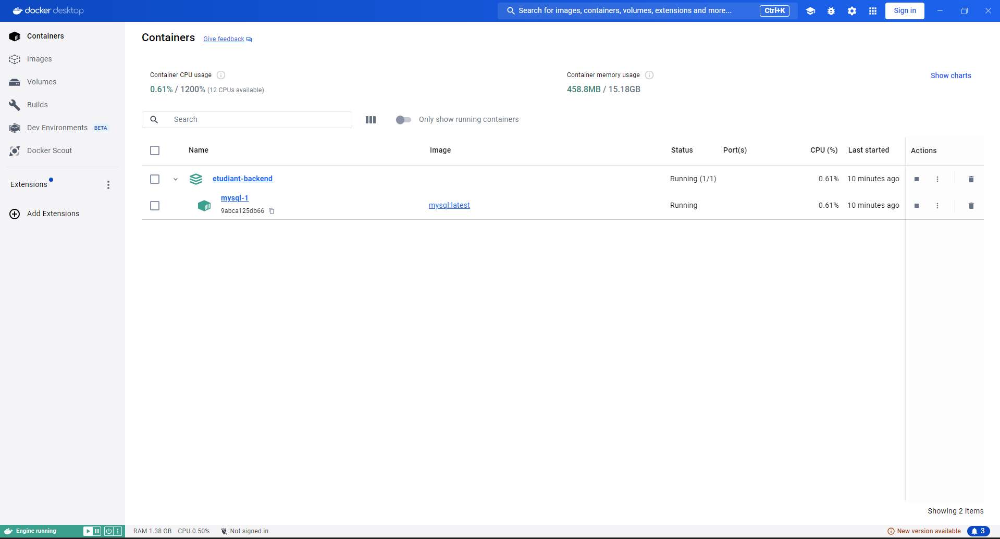
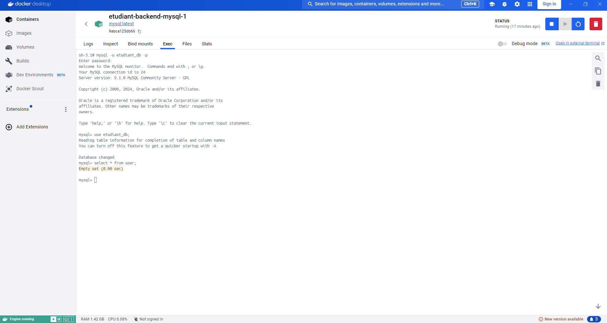

# MS etudiant-backend

Back-end qui gère les API des utilisateurs de la bibliothèque (agents) et le CRUD des étudiants.

## Configuration du back-end

    - name: etudiant-backend
    - port: 8080

## Prérequis

    -> JDK 21
    -> Docker et Docker Compose (Docker Engine sous Linux, ou Docker Desktop)
    -> Maven 3.9.3 ou plus : facultatif, le Maven Wrapper ./mvnw du projet télécharge la bonne version

## Démarrage du back-end

Docker doit être démarré. À la racine du dossier `backend/` :

```
./mvnw spring-boot:run
```

Cette commande va :
 - démarrer le conteneur Docker de la base de données MySQL (décrit dans `compose.yaml`, identifiants dans `.env`) ;
 - lancer le serveur du back-end et le connecter à la base ;
 - créer ou mettre à jour les tables `user` et `etudiant` à partir des entités Java.

`./mvnw` est le **Maven Wrapper** : il utilise la version de Maven fixée dans `.mvn/wrapper/maven-wrapper.properties`, identique sur tous les postes. La commande `mvn spring-boot:run` fonctionne aussi avec un Maven 3.9.3 ou plus installé sur le poste.

Les traces de démarrage se terminent par :
```
o.s.b.w.embedded.tomcat.TomcatWebServer  : Tomcat started on port 8080 (http) with context path '/'
c.o.etudiant.EtudiantBackendApplication  : Started EtudiantBackendApplication in 7.518 seconds
```

### Variable d'environnement JWT_SECRET

Les tokens JWT sont signés avec une clé secrète (256 bits minimum, encodée en Base64) lue dans la variable d'environnement `JWT_SECRET`.
Sans cette variable, une **clé de développement** définie dans `application.yml` est utilisée : elle est publique (dépôt GitHub) et ne doit jamais servir en production.

```
export JWT_SECRET=$(openssl rand -base64 32)
./mvnw spring-boot:run
```

### Débogage

Dans VS Code, la configuration « Déboguer le back-end » (`.vscode/launch.json`, à la racine du dépôt) lance l'application en mode débogage depuis ce dossier.

## Consulter la base de données

**En ligne de commande** (le nom du conteneur s'affiche avec `docker ps`) :

```
docker exec -it backend-mysql-1 mysql -u etudiant_db -p etudiant_db
```

Le mot de passe est identique au nom d'utilisateur : `etudiant_db`. Puis, par exemple :

```
select * from user;
select * from etudiant;
```

**Avec Docker Desktop** : un conteneur MySQL correspondant au projet apparaît.



Cliquez sur le lien `mysql-1`, puis, dans l'onglet `Exec` :

1. Connectez-vous à la base de données (mot de passe : `etudiant_db`) :

    ```
    mysql -u etudiant_db -p
    ```

2. Sélectionnez le schéma `etudiant_db` :

    ```
    use etudiant_db;
    ```

3. Consultez une table :

    ```
    select * from user;
    ```



## Routes de l'API

| Méthode | URL | Accès | Corps envoyé | Réponse |
|---|---|---|---|---|
| POST | `/api/register` | public | `{firstName, lastName, login, password}` | 201 ; 400 si champ manquant ou login déjà utilisé |
| POST | `/api/login` | public | `{login, password}` | 200 `{"token": "..."}` ; 400 si identifiants invalides |
| GET | `/api/etudiants` | Bearer token | — | 200 : liste des étudiants |
| GET | `/api/etudiants/{id}` | Bearer token | — | 200 ; 404 si introuvable |
| POST | `/api/etudiants` | Bearer token | `{firstName, lastName, email, birthDate, training}` | 201 + étudiant créé ; 400 si invalide ou e-mail déjà utilisé |
| PUT | `/api/etudiants/{id}` | Bearer token | idem POST | 200 + étudiant modifié ; 400 ; 404 |
| DELETE | `/api/etudiants/{id}` | Bearer token | — | 204 ; 404 si introuvable |

- « Bearer token » : en-tête `Authorization: Bearer <token>`, le token étant obtenu par `/api/login` (valable 1 heure). Sans token valide : **401**.
- `birthDate` au format `AAAA-MM-JJ` (ex. `"2001-05-17"`), obligatoirement dans le passé ; `email` au format d'une adresse e-mail et unique.
- Erreurs métier (login ou e-mail déjà utilisé, identifiants invalides, étudiant introuvable) : corps JSON `{timestamp, message, details}`. Erreurs de validation des champs (`@Valid`) : format standard de Spring (`ProblemDetail`), message dans le champ `detail`.

Une collection Postman de toutes ces routes est disponible dans [`../postman/`](../postman/).

## Exécution des tests

Docker doit être démarré : les tests d'intégration créent une base MySQL temporaire (Testcontainers, image `mysql:8.4`).

```
./mvnw clean test
```

`clean` supprime les classes compilées au préalable : utile si VS Code (extension Java) a compilé le projet dans le même dossier `target/`.

## Fonctionnalités portées

    - API de création d'un utilisateur (agent de la bibliothèque)
    - API d'authentification d'un utilisateur, qui retourne un token JWT
    - API CRUD des étudiants de la bibliothèque, sécurisées par token JWT

## Écrans ou blocs concernés

    - Écran d'inscription d'un agent (/register)
    - Écran de connexion (/login)
    - Écrans de gestion des étudiants : liste, détail, ajout, modification, suppression (/etudiants/...)
