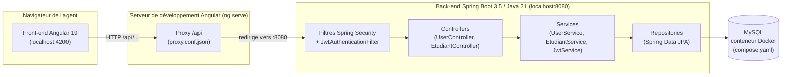
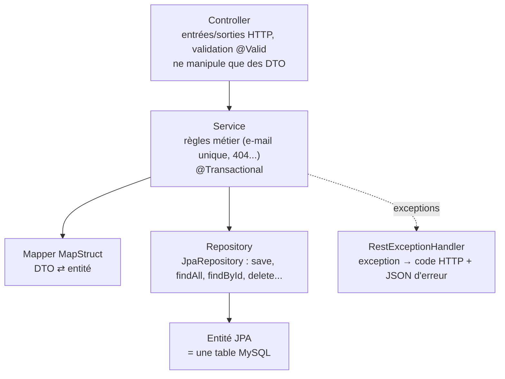
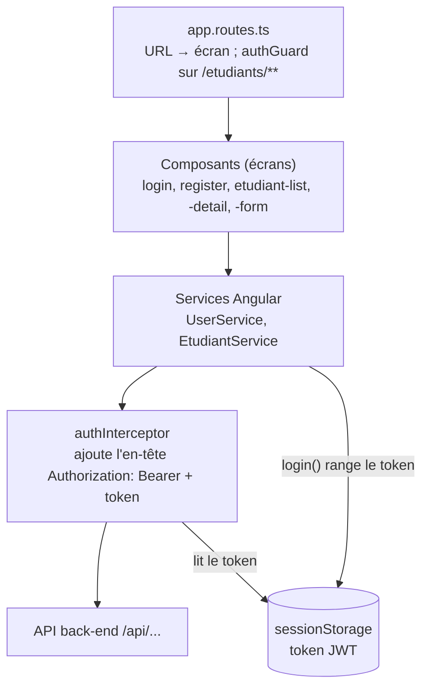
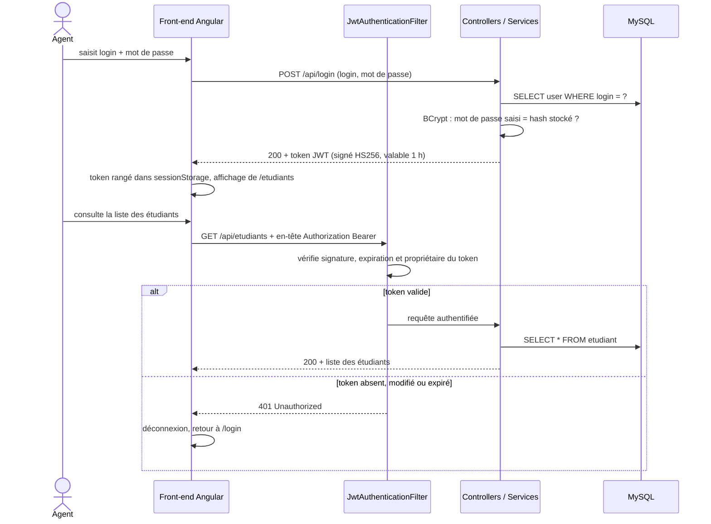

# Architecture d'EtuBibliothèque

Les schémas ci-dessous sont écrits en [Mermaid](https://mermaid.js.org/) : GitHub les affiche automatiquement sous forme de diagrammes.

## 1. Vue d'ensemble

- Le navigateur ne parle qu'au port 4200 ; le proxy Angular transmet les appels `/api/...` au back-end (pas de problème de CORS en développement).
- Au démarrage du back-end, la dépendance `spring-boot-docker-compose` lance le conteneur MySQL décrit dans `compose.yaml` (identifiants dans `.env`).
- Hibernate crée ou met à jour les tables (`user`, `etudiant`) à partir des entités Java (`ddl-auto: update`).

## 2. Couches du back-end

## 3. Couches du front-end

## 4. Parcours d'authentification JWT

**À retenir** : le serveur ne garde aucune session (`STATELESS`) ; c'est le token, présenté à chaque requête, qui prouve l'identité. Son contenu est lisible par tous (encodé en Base64, pas chiffré), mais il ne peut pas être modifié sans la clé secrète du serveur.
